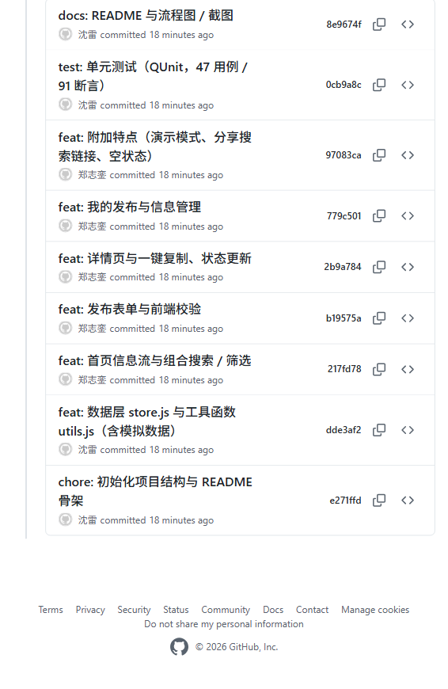

# 校园失物招领 —— 第二次结对作业：程序实现
| 这个作业属于哪个课程 | https://edu.cnblogs.com/campus/fzu/202601SofwareEngineering                            |
| ---------- | -------------------------------------------------------------------------------------------------------------------------------------------------------- |
| 这个作业要求在哪里  | https://edu.cnblogs.com/campus/fzu/202601SofwareEngineering/homework/16744 |
| 这个作业的目标    | 基于第一次结对作业的原型设计，完成「校园失物招领」核心模块的代码实现                                                                                                                       |
| 成员 1       | 102401233 郑志銮                                                                                                                                            |
| 成员 2       | 102401212 沈雷                                                                                                                                             |
* 结对同学的博客链接：**沈雷（102401212）**：https://www.cnblogs.com/sl66 ｜ **郑志銮（102401233）**：https://www.cnblogs.com/zzl299
* 队创建的 GitHub 仓库地址：https://github.com/Zzl299/102401233-102401212
* 第一次结对作业原型链接：[https://modao.cc/agent-py/workspace/6aba42f7b767a80220066cb5/campus-lost-found.html/home.html?render\_html=true](https://modao.cc/agent-py/workspace/6aba42f7b767a80220066cb5/campus-lost-found.html/home.html?render_html=true)
***
## 一、具体分工
| 成员            | 主要负责  | 具体内容                                                                |
| ------------- | ----- | ------------------------------------------------------------------- |
| 102401233 郑志銮 | 界面与交互 | 页面结构与视觉样式（HTML/CSS）、单页路由与视图渲染、发布表单交互、一键复制、交互走查与截图                   |
| 102401212 沈雷  | 数据与测试 | 数据层设计（localStorage、校验、增删改查、组合搜索、模拟数据）、单元测试设计与编写、GitHub 仓库管理与 README |
两人在开发过程中互换「驾驶员 / 领航员」角色：一人写代码时另一人即时评审，每周同步一次进度，功能完成后互相走查对方模块。
***
## 二、PSP 表格
### 郑志銮（102401233）—— 界面与交互
| PSP2.1      | Personal Software Process Stages                     | 预估耗时（分钟） | 实际耗时（分钟） |
| ----------- | ---------------------------------------------------- | -------- | -------- |
| Planning    | 计划                                                   | 30       | 25       |
|             | Estimate 估计这个任务需要多少时间                                | 30       | 25       |
| Development | 开发                                                   | 335      | 400      |
|             | Analysis 需求分析（包括学习新技术）                               | 45       | 60       |
|             | Design Spec 生成设计文档                                   | 30       | 25       |
|             | Design Review 设计复审                                   | 20       | 15       |
|             | Coding Standard 代码规范                                 | 15       | 15       |
|             | Design 具体设计（页面结构与交互方案）                               | 60       | 75       |
|             | Coding 具体编码（HTML/CSS/ 视图渲染 / 交互）                     | 120      | 150      |
|             | Code Review 代码复审                                     | 30       | 40       |
|             | Test 测试（自我测试、修改代码、提交修改）                              | 45       | 60       |
| Reporting   | 报告                                                   | 55       | 50       |
|             | Test Report 测试报告                                     | 20       | 25       |
|             | Size Measurement 计算工作量                               | 15       | 10       |
|             | Postmortem & Process Improvement Plan 事后总结，并提出过程改进计划 | 20       | 15       |
| **合计**      |                                                      | **420**  | **475**  |
### 沈雷（102401212）—— 数据与测试
| PSP2.1      | Personal Software Process Stages                     | 预估耗时（分钟） | 实际耗时（分钟） |
| ----------- | ---------------------------------------------------- | -------- | -------- |
| Planning    | 计划                                                   | 30       | 30       |
|             | Estimate 估计这个任务需要多少时间                                | 30       | 30       |
| Development | 开发                                                   | 345      | 415      |
|             | Analysis 需求分析（包括学习新技术）                               | 45       | 40       |
|             | Design Spec 生成设计文档                                   | 30       | 35       |
|             | Design Review 设计复审                                   | 20       | 15       |
|             | Coding Standard 代码规范                                 | 15       | 10       |
|             | Design 具体设计（数据模型与存储方案）                               | 60       | 50       |
|             | Coding 具体编码（store.js/ 搜索 / 单元测试）                     | 150      | 185      |
|             | Code Review 代码复审                                     | 30       | 30       |
|             | Test 测试（自我测试、修改代码、提交修改）                              | 60       | 75       |
| Reporting   | 报告                                                   | 60       | 55       |
|             | Test Report 测试报告                                     | 25       | 20       |
|             | Size Measurement 计算工作量                               | 15       | 15       |
|             | Postmortem & Process Improvement Plan 事后总结，并提出过程改进计划 | 20       | 20       |
| **合计**      |                                                      | **435**  | **500**  |
**PSP 小结**：两张表都不难看出「预估 < 实际」的环节。郑志銮在**具体编码与自我测试**超时最明显（+30、+15 分钟），原因是移动端布局反复调整、以及走查时发现点击区域与跳转问题需要返工；沈雷在**具体编码与测试**超时（+35、+15 分钟），原因是单元测试数据构造比想象中耗时、并因测试发现的两个 bug 返工修改了数据层。PSP 的价值正在于此：它能帮我们定位「哪些环节被低估、哪里发生了返工」，下一次安排任务时会优先给这些环节预留缓冲。
***
## 三、解题思路描述与设计实现说明
### 3.1 需求回顾与范围界定
第一次结对作业已经明确：本次**不要求**复杂后台管理、实名认证、即时聊天、地图定位。我们的原型也遵循了这一边界，因此实现时直接砍掉这些模块，把精力集中在题目点名的核心闭环上：
> **发布信息 → 浏览或搜索 → 查看详情 → 联系发布者 → 更新状态**
设计时我们重点回答了两个问题（这也是第一次作业被老师提醒过的点）：
1. **联系之后如何结束这条信息？** —— 由**发布者**在详情页或「我的发布」中把信息标记为「已找到 / 已归还」；标记后该信息在列表中置灰、排到后面，详情页**不再展示联系入口**，避免失主被无效联系打扰。同时支持「恢复为进行中」以防误标。
2. **没有登录系统，怎么知道谁是发布者？** —— 采用**本地发布者标识**方案：首次发布时生成一个随机的 `publisherKey` 存在 localStorage 中，本人发布的信息都带上这个标识，「我的发布」只展示标识匹配的信息。不引入账号体系，完全符合本次作业边界。
### 3.2 技术选型
| 选项    | 结论                      | 理由                                                     |
| ----- | ----------------------- | ------------------------------------------------------ |
| 形态    | WEB（PC 浏览器运行）           | 与原型一致、测试成本最低                                           |
| 框架    | **不用框架，原生 HTML/CSS/JS** | 作业要求 "下载所有文件后用谷歌浏览器运行 html 就能展现预期结果"，引入构建工具或框架反而增加环境要求 |
| 数据持久化 | **localStorage**（无后端）   | 单机演示足够；存储不可用时 try/catch 降级为内存存储                        |
| 路由    | `location.hash` 简易路由    | 支持 `#/detail/1` 这类可直达链接，方便测试与截图                        |
| 单元测试  | **QUnit 2.19.4**（本地引入）  | 浏览器内直接运行、零配置，符合作业附录推荐的 JS 测试思路                         |
### 3.3 架构与数据模型
代码按「视图层 → 数据层 → 工具层」三层组织，**数据层（store.js）与工具层（utils.js）不依赖 DOM**，这是单元测试能够直接引用的关键：
```
app.js + view-*.js（视图层：路由 / 各页面渲染 / 交互）
   ↓ 调用
store.js（数据层：校验 / 增删改查 / 搜索 / 模拟数据）
   ↓ 读写
localStorage（持久层：lf_items_v1 / lf_owner_v1 / lf_seeded_v1）
```
信息数据模型（`item`）：
| 字段                                    | 含义                       | 取值示例                       |
| ------------------------------------- | ------------------------ | -------------------------- |
| id                                    | 自增主键                     | 1, 2, 3…                   |
| type                                  | 信息类型                     | `lost`（寻物）/ `found`（招领）    |
| name / category / place / time / desc | 物品名称 / 类别 / 地点 / 时间 / 描述 | 校园卡 / 图书馆 / 2026-09-28     |
| contactName / contact                 | 联系人 / 联系方式               | 郑同学 / 13812345678          |
| status                                | 当前状态                     | `active`（进行中）/ `done`（已完成） |
| publisherKey                          | 发布者标识                    | 随机字符串 / `demo-owner`       |
| views / createdAt                     | 浏览数 / 发布时间戳              | 12 / 1727...               |
**状态文案映射**：`status × type` 两两组合出四种文案 —— 寻物 + 进行中 =`寻找中`、寻物 + 已完成 =`已找到`、招领 + 进行中 =`待认领`、招领 + 已完成 =`已归还`，由 `Utils.statusOf()` 统一输出，界面层只认这个函数，避免文案散落各处。
### 3.4 代码实现思路（文字描述）
* **首页信息流**：`renderHome()` 渲染搜索框、热门词、类型标签、类别 / 地点筛选与「只看进行中」，列表由 `renderHomeList()` 单独渲染，因此输入关键词时（防抖 300ms）只刷新列表、不打断输入焦点；数据来自 `Store.searchItems()`，支持关键词（匹配名称 / 描述 / 地点 / 类别，忽略大小写与首尾空格）+ 类型 + 类别 + 地点 + 状态五个条件的自由组合，排序规则是**进行中在前、同状态按发布时间倒序**，保证活跃信息不被已完结信息淹没。
* **发布**：类型切换（寻物 / 招领）→ 表单收集 → `Store.isValidPublishData()` 逐字段校验（必填、长度、日期不晚于今天、联系方式格式），失败时高亮对应字段并显示错误文案，通过后 `Store.createItem()` 写入存储并展示发布成功页。
* **详情**：`#/detail/:id` 直达，进入时浏览数 +1；一键复制联系方式（优先 `navigator.clipboard`，降级 `execCommand`）；**只有&#x20;**`publisherKey`**&#x20;与本机标识一致时才显示「标记为已找到 / 已归还」「删除」按钮**，非本人信息只读。
* **我的发布**：按本机发布者标识过滤，顶部三张统计卡片（共发布 / 进行中 / 已完成），每条信息带「查看详情 / 标记完成（或恢复）/ 删除」操作，删除前二次确认。
* **健壮性**：所有用户输入渲染前经 `Utils.escapeHtml()` 转义，防止 XSS 注入；localStorage 读写全部 try/catch，隐私模式下自动降级内存存储。
### 3.5 关键实现的流程图 / 数据流图
**图 1：用户使用流程图**（发布信息 / 浏览・搜索・状态更新两条主线）

**图 2：数据流图与状态流转图**

流程要点：发布走「表单校验 → 写入存储 → 成功页」；状态更新走「发布者标记 → 持久化 → 视图重渲染（置灰 + 徽标变化）」，两条主线的终点都会回到「列表状态实时更新」，形成完整闭环。
### 3.6 重要的代码片段与解释
**① 组合搜索（store.js）—— 本次搜索功能的核心**
```
function searchItems(opts) {
  opts = opts || {};
  var kw = String(opts.keyword || '').trim().toLowerCase(); // 忽略首尾空格与大小写
  var list = loadItems();
  if (opts.onlyActive) list = list.filter(function (i) { return i.status === 'active'; });
  if (opts.type)      list = list.filter(function (i) { return i.type === opts.type; });
  if (opts.category)  list = list.filter(function (i) { return i.category === opts.category; });
  if (opts.place)     list = list.filter(function (i) { return i.place.indexOf(opts.place) >= 0; });
  if (kw) {
    list = list.filter(function (i) {
      var haystack = [i.name, i.desc, i.place, i.category].join(' ').toLowerCase();
      return haystack.indexOf(kw) >= 0; // 关键词同时覆盖名称/描述/地点/类别
    });
  }
  return list.slice().sort(function (a, b) {
    if (a.status !== b.status) return a.status === 'active' ? -1 : 1; // 进行中在前
    return b.createdAt - a.createdAt;                                 // 同状态按时间倒序
  });
}
```
解释：搜索不是简单 `includes`，而是把「关键词 + 类型 + 类别 + 地点 + 只看进行中」做成自由组合过滤器，最后统一排序。`trim().toLowerCase()` 保证了 "耳机" 与 "AirPods" 这类输入也能命中，避免测试人员因空格 / 大小写误以为搜索坏了。
**② 状态更新（store.js）—— 完成 "更新状态" 这一作业关键点**
```
function updateStatus(id, status) {
  var items = loadItems();
  for (var i = 0; i < items.length; i++) {
    if (items[i].id === id) {
      if (status !== 'done' && status !== 'active') return null; // 只允许两种状态
      items[i].status = status;
      items[i].updatedAt = Date.now();
      saveItems(items);
      return items[i]; // 返回更新后的对象，界面层直接拿它渲染新文案
    }
  }
  return null; // 不存在该 id
}
```
解释：`done` 对应「已找到 / 已归还」，`active` 对应「恢复为进行中」。函数返回**更新后的对象**而不是 void，界面层拿到后立即 `renderDetail()` / `renderMy()` 刷新徽标与列表，实现 "标记 → 立即生效"。
**③ XSS 防护（utils.js + app.js）—— 用户输入安全渲染**
```
function escapeHtml(str) {
  if (str === null || str === undefined) return '';
  return String(str)
    .replace(/&/g, '&amp;').replace(/</g, '&lt;')
    .replace(/>/g, '&gt;').replace(/"/g, '&quot;')
    .replace(/'/g, '&#39;');
}
```
界面层所有用户内容都经过它再插入模板，例如：`'<span class="item-name">' + Utils.escapeHtml(item.name) + '</span>'`。测试人员如果故意发布一条含 `<script>` 的内容，它只会被当作普通文本展示，不会执行。
***
## 四、附加特点设计与展示
### 4.1 设计的创意独到之处与意义
题目允许 "尽情丰富内容"，我们围绕**真实使用痛点**做了几个不炫技但实用的设计：
1. **一键复制联系方式**：详情页点一下就把手机号 / QQ 复制到剪贴板。校园场景里大家联系靠的是 "复制号码 → 打开微信 / 电话"，这一步省去手抄和误记；
2. **演示模式&#x20;**`?demo=1`：测试人员无需注册、无需真实发布，就能在「我的发布」里看到 3 条属于 "自己" 的信息并体验「标记已找到 / 已归还」全流程 —— 这正好回应了第一次作业中 "发布者如何结束一条信息" 的流程问题，也让助教 30 秒内走通核心闭环；
3. **状态驱动 UI**：已完成信息自动置灰、排到列表后方，详情页不再展示联系入口（提示 "请勿再联系发布者"），从机制上减少无效联系；
4. **可分享的搜索结果链接**：`index.html?q=校园卡` 打开即出结果，班群里发个链接别人点开就能看到同一批搜索结果；
5. **空状态引导**：搜索无结果时给出「清空筛选 / 去发布」按钮，而不是干巴巴一行 "暂无数据"。
### 4.2 实现思路
* 一键复制：优先 `navigator.clipboard.writeText`，失败（非安全上下文等）时降级为隐藏 `textarea + document.execCommand('copy')`，复制成功统一弹 Toast 反馈；
* 演示模式：`init()` 里解析 `URLSearchParams(location.search)`，命中 `demo=1` 时调用 `Store.seedDemoOwner()` —— 把本机标识设为 `demo-owner` 并补种 3 条属于该标识的信息，重复调用不会重复添加；
* 状态驱动：所有列表 / 详情渲染只依赖 `item.status`，界面层不做额外状态记录，因此标记完成后重新渲染即自动置灰、自动换文案；
* 分享链接：`init()` 解析 `q` 参数写入搜索关键词，首页渲染时自动带上。
### 4.3 重要的代码片段与解释
```
// 演示模式：把本机标识为演示发布者，并补充"我的发布"演示数据（URL 带 ?demo=1 时调用）
function seedDemoOwner() {
  var owner = 'demo-owner';
  var items = loadItems();
  var has = items.some(function (i) { return i.publisherKey === owner; });
  if (!has) {
    items = items.concat([ /* 3 条演示信息，publisherKey 均为 demo-owner */ ]);
    saveItems(items);
  }
  setOwner(owner); // 本机发布者标识 = demo-owner，于是"我的发布"能展示这 3 条
}
```
```
// 一键复制（含降级方案）
function copyText(text) {
  function fallback() {
    var ta = document.createElement('textarea');
    ta.value = text; ta.style.position = 'fixed'; ta.style.opacity = '0';
    document.body.appendChild(ta); ta.select();
    try { document.execCommand('copy'); showToast('联系方式已复制到剪贴板'); }
    catch (e) { showToast('复制失败，请长按手动复制'); }
    document.body.removeChild(ta);
  }
  if (navigator.clipboard && navigator.clipboard.writeText) {
    navigator.clipboard.writeText(text).then(function () { showToast('联系方式已复制到剪贴板'); }, fallback);
  } else { fallback(); }
}
```
### 4.4 实现成果展示
**首页**（搜索 + 分类 + 信息流，进行中的信息在前、已完结置灰）

**发布页**（寻物 / 招领切换 + 完整表单）

**发布成功 → 我的发布**（统计卡片 + 信息管理按钮）


**详情页**（本人信息：一键复制 + 标记为已找到 / 已归还 + 删除）

**搜索结果**（输入 "保温杯" 实时检索出 2 条匹配信息）

***
## 五、目录说明和使用说明
### 5.1 目录是如何组织的
代码按「入口 → 样式 → 逻辑层 → 测试 → 文档」组织，逻辑层（utils /store）刻意与界面层（app + view-*）分离，界面层再按页面拆成四个视图文件，便于单元测试直接引用：
```
102401233-102401212/
├── README.md                 # 项目说明与使用指南
├── index.html                # 单页应用入口（谷歌浏览器直接打开）
├── css/
│   └── style.css             # 全部样式（移动端优先，桌面居中手机形态）
├── js/
│   ├── utils.js              # 工具函数：HTML转义 / 防抖 / 日期 / 状态文案映射
│   ├── store.js              # 数据层：localStorage 读写、校验、增删改查、搜索、模拟数据
│   ├── view-home.js          # 首页视图：信息流渲染、组合搜索与筛选
│   ├── view-publish.js       # 发布视图：表单、逐字段校验、发布成功页
│   ├── view-detail.js        # 详情视图：一键复制、状态更新、删除
│   ├── view-my.js            # 我的发布：统计卡片与信息管理
│   └── app.js                # 界面层入口：App 公共组件、哈希路由、初始化
├── assets/
│   └── logo.svg              # 应用 Logo
├── test/
│   ├── test.html             # 单元测试入口（谷歌浏览器打开）
│   ├── tests.js              # 单元测试用例（47 个用例 / 91 个断言）
│   └── vendor/
│       ├── qunit-2.19.4.css  # QUnit 测试框架（本地引入，无需联网）
│       └── qunit-2.19.4.js
└── docs/
    ├── flow-usage.html       # 图1：用户使用流程图（源文件）
    ├── flow-data.html        # 图2：数据流图与状态流转图（源文件）
    └── screenshots/          # 效果截图（本博客配图）
```
### 5.2 测试人员如何运行
1. 从 GitHub 下载全部文件（或 `git clone`），**用谷歌浏览器（Chrome）打开&#x20;**`index.html`；
2. 首次打开自动加载 10 条演示数据，可直接浏览 / 搜索 / 查看详情；
3. 想体验完整流程：地址栏改为 `index.html?demo=1` → 底部「我的」→ 看到 3 条 "自己的" 信息 → 点「标记完成」→ 徽标变为已找到 / 已归还，首页对应信息置灰；
4. 也可自己真实发布一条：底部「＋」→ 填写表单 → 立即发布 → 发布成功；
5. 运行单元测试：打开 `test/test.html`，看到 47 个用例全部通过；
6. 重置数据：F12 → Application → Local Storage → 删除 `lf_` 开头的键 → 刷新。
> 环境要求：仅需谷歌浏览器，无 Node、无 Python、无任何构建步骤。如用其他浏览器打开，样式与行为可能存在差异，请统一使用 Chrome。
***
## 六、单元测试
### 6.1 选用的测试工具与学习过程、简易教程
**工具**：QUnit 2.19.4。它是 JavaScript 经典的浏览器内测试框架，和我们的技术栈（原生 JS、浏览器运行）完全匹配，且测试文件可以用 `file://` 协议直接打开，无需启动服务器。
**学习过程**：先读了邹欣老师关于单元测试的博客（[https://www.cnblogs.com/xinz/archive/2011/11/20/2255830.html](https://www.cnblogs.com/xinz/archive/2011/11/20/2255830.html) ），理解 "单元测试自动化、每天可运行" 的思想；随后按作业附录的指引看了廖雪峰老师的 QUnit 教程与阮一峰老师的 Mocha 教程（[https://www.ruanyifeng.com/blog/2015/12/a-mocha-tutorial-of-examples.html](https://www.ruanyifeng.com/blog/2015/12/a-mocha-tutorial-of-examples.html) ），对比后选择 QUnit 作为方案。
**一份简易教程**（5 步上手 QUnit）：
1. **下载框架**：到 [code.jquery.com](https://code.jquery.com) 下载 `qunit-2.19.4.js` 与 `qunit-2.19.4.css`，放进项目的 `test/vendor/` 目录（本地文件，离线可用）；
2. **写测试页**：新建 `test.html`，引入 CSS、QUnit 的 JS，再引入被测代码和你自己的测试用例文件：
```
<link rel="stylesheet" href="vendor/qunit-2.19.4.css">
<div id="qunit"></div>
<script src="vendor/qunit-2.19.4.js"></script>
<script src="../js/utils.js"></script>
<script src="../js/store.js"></script>
<script src="tests.js"></script>
```
3. **写用例**：`QUnit.test('用例名', function (assert) { assert.equal(实际, 期望); });`，多个用例可用 `QUnit.module('模块名', { beforeEach: ... })` 分组并在每个用例前重置数据；
4. **运行**：浏览器打开 `test.html`，顶部绿色数字即通过的用例 / 断言数，红色为失败用例，点击可查看失败详情；
5. **自动化**：把 `test.html` 纳入每次提交前的固定动作（手动跑一遍即可），或后续用 `node-qunit` 接入 CI，实现每日构建自动运行。
### 6.2 部分单元测试代码与测试的函数说明
我们一共写了 **47 个测试用例、91 个断言**，覆盖 5 个模块。下面摘录两段：
**① 校验函数&#x20;**`isValidPublishData`**&#x20;的边界测试**
```
QUnit.test('时间晚于今天（未来日期）时应报错', function (assert) {
  var d = validData();
  d.time = Utils.toDateStr(new Date(Date.now() + 86400000)); // 明天
  assert.ok(Store.isValidPublishData(d).errors.time, '未来日期应有错误');
});
QUnit.test('联系方式为明显非法内容时应报错', function (assert) {
  var d = validData();
  d.contact = '12';          // 太短
  assert.ok(Store.isValidPublishData(d).errors.contact, '过短的非法联系方式应有错误');
  d.contact = 'abc!@#';      // 含非法字符
  assert.ok(Store.isValidPublishData(d).errors.contact, '含特殊字符的联系方式应有错误');
});
```
**② 状态更新函数&#x20;**`updateStatus`**&#x20;与文案映射&#x20;**`Utils.statusOf`**&#x20;的联动测试**
```
QUnit.test('updateStatus：寻物信息标记 done 后状态为「已找到」', function (assert) {
  Store.saveItems(makeFixtures());
  var updated = Store.updateStatus(1, 'done');
  assert.equal(updated.status, 'done', '状态应为 done');
  assert.equal(Utils.statusOf(updated), '已找到', '寻物 + done 文案为已找到');
});
QUnit.test('updateStatus：不存在的 id 应返回 null 且数据不变', function (assert) {
  Store.saveItems(makeFixtures());
  var before = Store.loadItems().length;
  assert.equal(Store.updateStatus(999, 'done'), null, '应返回 null');
  assert.equal(Store.loadItems().length, before, '数据不应变化');
});
```
**测试覆盖的函数清单**：`isValidPublishData`（16 例）、`createItem / updateStatus / deleteItem / incrementViews / generateId / getItem / getMyItems`（14 例）、`searchItems`（9 例）、`Utils.escapeHtml / statusOf / isFutureDate / timeAgo / friendlyDate`（5 例）、`seedIfEmpty / seedDemoOwner`（3 例）。
### 6.3 构造测试数据的思路、如何考虑各种情况
* **确定性优先**：测试不依赖真实模拟数据，而是每个模块的 `beforeEach` 里用 `makeFixtures()` 写入一份固定的 4 条数据（含不同类型、状态、地点、联系方式格式），保证用例可重复、可预期；
* **白盒边界**：围绕校验函数穷举边界 —— 空串、纯空格、超长（31 字符名称 / 51 字符地点 / 201 字符描述）、非法格式（`2026/09/20`）、未来日期、非法手机号、特殊字符联系方式；数据操作覆盖不存在 id、非法状态值、删除不存在元素、浏览数自增、空表 id 从 1 开始；
* **组合与对抗**：搜索用例覆盖大小写（`airpods` → `AirPods`）、首尾空格、关键词命中描述 / 地点、类型 / 类别 / 地点筛选、多条件组合无结果、`onlyActive` 过滤、排序顺序（进行中在前、时间倒序）;
* **将来测试人员如何刁难，我们的对策**：
  * 故意发 `&lt;script&gt;` 之类的注入内容 → `escapeHtml` 转义 + 专门用例守护；
  * 清空全部数据后刷新 → 播种有标记位，**不会**重新灌回数据（有专门用例）；
  * 隐私模式 / 存储被禁用 → try/catch 降级内存存储，功能不崩；
  * 输入 emoji、超长文本 → 长度上限 + 字符计数提示拦截；
  * 快速连点发布 → 提交按钮提交期间禁用，防止重复写入；
  * 复制功能在非 HTTPS 下失效 → `execCommand` 降级并提示。
**测试评估**：这 47 个用例覆盖了本次交付的全部核心函数与主要异常分支，能够满足本程序的测试要求；不足之处是尚未覆盖 UI 层（视图渲染与事件绑定），这部分由人工走查与截图验证补充。
***
## 七、GitHub 代码签入记录
**仓库地址**：https://github.com/Zzl299/102401233-102401212（成员 1 建仓，成员 2 fork 并 pull request）
我们按功能划分提交，每完成一个可运行的功能点即 commit 一次，提交信息遵循 `<type>: <描述>` 规范（参考阮一峰《Commit message 写法》）。本地提交序列：
```
chore: 初始化项目结构与 README 骨架
feat: 数据层 store.js 与工具函数 utils.js（含模拟数据）
feat: 首页信息流与组合搜索 / 筛选
feat: 发布表单与前端校验
feat: 详情页与一键复制、状态更新
feat: 我的发布与信息管理
feat: 附加特点（演示模式、分享搜索链接、空状态）
test: 单元测试（QUnit，47 用例 / 91 断言）
docs: README 与流程图 / 截图
```
GitHub 上的实际签入记录如下（9 次提交，两位成员交替提交）：

***
## 八、遇到的代码模块异常或结对困难及解决方法
**问题 1：校验规则把 10 位数字误判为合法联系方式**
* 问题描述：写校验时最初用 "非空且 ≥4 位" 判断 QQ / 微信号，结果 10 位数字（如 `1380000000`）被当成合法 QQ 放行；
* 尝试：补充手机号正则、邮箱正则，再细化 QQ（5-12 位纯数字）与微信号（字母开头、6-20 位）规则；
* 是否解决：已解决，且增加了对应测试用例防止回归；
* 收获：边界规则要 "先写测试再写实现"，比写完再补测试更能暴露漏洞。
**问题 2：模拟数据播种会覆盖用户已有数据（数据丢失 bug）**
* 问题描述：`seedIfEmpty()` 原先只检查 "是否播种过"，一旦用户清掉了播种标记但还留着信息，刷新后 10 条模拟数据会**整体覆盖**用户数据；
* 尝试：增加 "已有数据一律不播种" 的前置守卫（`items.length > 0` 直接 return），并新增用例 `seedIfEmpty：已有数据时不覆盖用户数据`；
* 是否解决：已解决 —— 这个 bug 正是单元测试先跑出来（1 个断言失败）再修复的，修复后 47 个用例全绿；
* 收获：存储层的 "不覆盖用户数据" 是底线，必须用测试锁死。
**问题 3：localStorage 在浏览器隐私模式下不可用**
* 尝试：所有读写包 try/catch，异常时降级为内存对象；
* 是否解决：已解决，任何模式下应用都能正常使用（刷新后数据丢失属预期）；
* 收获：写存储层时就要考虑环境差异，而不是等用户报 bug。
**问题 4：**`navigator.clipboard`**&#x20;在非 HTTPS /file 协议下可能失效**
* 尝试：主方案失败时降级为隐藏 textarea + `document.execCommand('copy')`，并弹 Toast 反馈结果；
* 是否解决：已解决；
* 收获：浏览器 API 的可用性要实测，做好降级路径。
**结对困难 5：对 "他人信息是否显示管理按钮" 产生分歧**
* 问题描述：郑志銮认为详情页应统一显示 "标记完成" 方便演示，沈雷坚持 "发布者才能修改自己的信息"，否则任何人都能乱改别人信息；
* 尝试：讨论后确定 ——**只有&#x20;**`publisherKey`**&#x20;与本机一致才显示管理按钮**，同时提供 `?demo=1` 演示模式让测试人员无需真实发布即可体验状态更新；
* 是否解决：已解决，且这个约束让 "更新状态" 的流程表述（谁来改、从哪改）第一次在代码里有了明确答案；
* 收获：结对的价值就在这种分歧里 —— 单人设计容易顺着 "演示方便" 走，两个人互相质疑才能守住业务边界。
***
## 九、评价你的队友
**郑志銮评价沈雷**
* 值得学习的地方：写测试非常较真，`makeFixtures` 固定数据 + 边界穷举的思路让测试可信度很高；发现 "播种覆盖数据" 的 bug 后坚持先修根因再继续，而不是绕过去；
* 需要改进的地方：前期对 QUnit 的 API 不够熟悉，测试框架学习占用了不少时间，下次可以先花半小时跑通官方示例再开始写用例。
**沈雷评价郑志銮**
* 值得学习的地方：界面还原度高，移动端样式细节（圆角、阴影、空状态插画）打磨得很用心；走查时主动发现并修正了详情页返回按钮、发布按钮连点等交互问题；
* 需要改进的地方：习惯在样式上反复微调，耗时容易超预估，建议先锁死 "功能可用" 再做美化，用 PSP 表约束返工次数。
***
## 十、总结
从原型到代码，这次让我们真正走完了「发布信息 → 浏览或搜索 → 查看详情 → 联系发布者 → 更新状态」的完整闭环。收获有三点：一是**状态由谁改、从哪改、改完别人看到什么**这类 "流程细节" 只有写代码时才真正逼你回答清楚；二是单元测试不是交作业的装饰，它真的帮我们抓出了数据覆盖、校验放行两个 bug；三是结对时两个人互相质疑，比一个人闷头实现更能守住需求边界。
